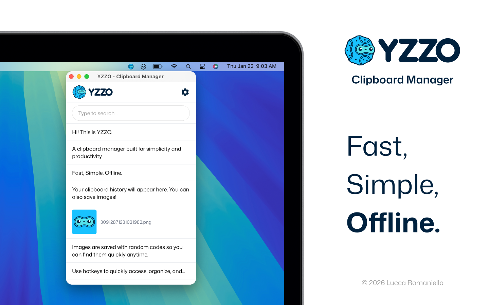

<div align="center">
  
  <h1><a href="https://yzzo.app">YZZO - Clipboard Manager</a></h1>
  <p>
    A modern clipboard manager built for simplicity and productivity. Available for macOS and Linux.
  </p>
</div>

## Privacy first

- **No data collection**: YZZO does not collect, transmit, or share any of your data.
- **Local storage only**: All clipboard history is stored locally on your device using SQLite.
- **Complete privacy**: Your clipboard data never leaves your computer.

## Prerequisites

Before getting started, you'll need to install a few tools:

1. **Bun** - Fast JavaScript runtime and package manager
   - Install from: https://bun.com/docs/installation
   - Note: You can also use npm or another package manager, but you'll need to adjust the startup scripts in `package.json`

2. **Tauri + Rust** - Desktop app framework
   - Follow the installation guide: https://tauri.app/start/prerequisites/ (You may skip the mobile setup).

## Getting started

After installing the prerequisites and restarting your terminal:

```bash
# Install dependencies
bun install

# Start development server
bun run tauri dev
```

You're now ready for development!

## Tech stack

- **Frontend**: React, TanStack Router, TailwindCSS
- **Runtime**: Bun
- **Backend**: Rust
- **Database**: SQLite
- **Framework**: Tauri

## Project structure

- `/src` - React frontend code
- `/src/routes` - Application routes (TanStack Router)
- `/src-tauri` - Rust backend code

## Building for production

```bash
bun run tauri build
```

This will create optimized binaries for your platform in `src-tauri/target/release`.

## App Store distribution

The files in `src-tauri/` related to App Store distribution (`Entitlements.plist`, `Info.plist`, `tauri.appstore.conf.json`) contain placeholder values. **You do not need to modify these files to build and run the app locally.**

Official App Store distribution is handled by the maintainer. If you wish to distribute your own version under the [LICENSE](LICENSE), follow the official [Tauri documentation](https://tauri.app/distribute/app-store/#setting-up).

## Feedback and bug reports

Have feedback, found a bug, or want to request a feature? Please [open an issue on GitHub](https://github.com/yzzoapps/yzzo/issues).

## License

This project is licensed under the GNU General Public License v3.0 (GPL-3.0).
See the [LICENSE](LICENSE) file for the complete license text.

## Credits
Created by [Lucca Romaniello](https://github.com/luccaromaniello), built with Zed editor using the [Nyx theme](https://github.com/luccaromaniello/nyx).
